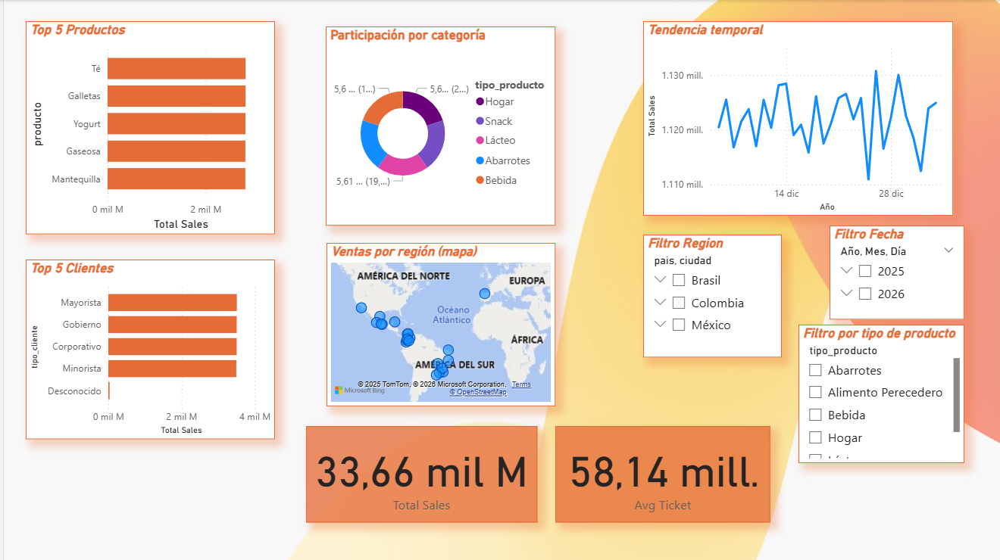

# 🔷 Riwi Analytics — LATAM Retail Data Analysis

> End-to-end data analytics assessment: from raw CSV to strategic business intelligence across Brazil, Colombia & Mexico.

**Author**: Dieguito Coder  
**Assessment**: Riwi Analytics Employability — 2026  
**Stack**: PostgreSQL · Python · Power BI · Jupyter

---

## 📋 Table of Contents

- [Project Overview](#-project-overview)
- [Data Pipeline Flow](#-data-pipeline-flow)
- [Project Structure](#-project-structure)
- [Database Model (Star Schema)](#-database-model-star-schema)
- [SQL Analytical Queries](#-sql-analytical-queries)
- [ETL Pipeline (Python)](#-etl-pipeline-python)
- [Exploratory Data Analysis (EDA)](#-exploratory-data-analysis-eda)
- [Power BI Dashboards](#-power-bi-dashboards)
- [Business Insights & Conclusions](#-business-insights--conclusions)
- [Technologies & Tools](#-technologies--tools)
- [How to Reproduce](#-how-to-reproduce)
- [Key Metrics](#-key-metrics)

---

## 🎯 Project Overview

This project demonstrates a **complete data analytics workflow** designed to transform raw LATAM retail sales data into actionable business insights. It covers every stage of the analytics lifecycle:

1. **Data Cleaning** — Automated 12-stage pipeline to clean, validate, and transform raw data
2. **Data Modeling** — Star Schema design for optimized BI reporting
3. **ETL Process** — Automated loading from CSV to PostgreSQL with idempotent dimension handling
4. **Analytical Queries** — 14 SQL queries from basic aggregations to advanced window functions
5. **Exploratory Analysis** — Statistical analysis and visualization in Jupyter
6. **Dashboards** — Interactive Power BI dashboards for executive storytelling
7. **Web Portal** — Custom presentation page with insights and visual gallery

---

## 🔄 Data Pipeline Flow

The project follows a **hybrid analytical architecture** where each tool is used for what it does best:

```
┌─────────────┐     ┌─────────────────┐     ┌──────────────────┐
│  Datos.csv  │ ──► │  limpieza.py    │ ──► │ Datos_limpio.csv │
│  (Raw Data) │     │  (12 cleaning   │     │  (Clean Data)    │
│             │     │   stages)       │     │                  │
└─────────────┘     └─────────────────┘     └────────┬─────────┘
                                                     │
                    ┌────────────────────────────────┘
                    │
                    ▼
┌──────────────────────────────┐     ┌──────────────────────┐
│  conexion_carga_datos.py     │ ──► │  PostgreSQL          │
│  (ETL: CSV → Star Schema)    │     │  ┌── dim_fecha       │
│  • Loads dimensions first    │     │  ├── dim_region      │
│  • Then loads fact table     │     │  ├── dim_cliente     │
│  • ON CONFLICT idempotency   │     │  ├── dim_producto    │
│  • TRUNCATE for fact table   │     │  └── fact_ventas ◄───┤
└──────────────────────────────┘     └──────────┬───────────┘
                                                │
                    ┌───────────────────────────┼──────────┐
                    │                           │          │
                    ▼                           ▼          ▼
         ┌──────────────────┐     ┌──────────────┐  ┌──────────┐
         │  bbdd.sql        │     │  EDA Notebook│  │ Power BI │
         │  (14 analytical  │     │  (6 charts   │  │ (4 dash- │
         │   queries)       │     │ + interpret) │  │  boards) │
         └──────────────────┘     └──────────────┘  └─────┬────┘
                                                          │
                                                          ▼
                                                 ┌────────────────┐
                                                 │  portal/       │
                                                 │  (Web insights │
                                                 │   & gallery)   │
                                                 └────────────────┘
```

### Flow Summary

| Step | Input | Process | Output | Tool |
|------|-------|---------|--------|------|
| 1 | `Datos.csv` | Data cleaning (12 stages) | `Datos_limpio.csv` | Python (Pandas) |
| 2 | `Datos_limpio.csv` | ETL load to database | Star Schema tables | Python (SQLAlchemy) |
| 3 | PostgreSQL tables | Analytical queries | Business metrics | SQL |
| 4 | `Datos_limpio.csv` | Statistical analysis | Charts + insights | Jupyter (Matplotlib/Seaborn) |
| 5 | PostgreSQL tables | Dashboard creation | Interactive visuals | Power BI |
| 6 | Dashboard exports | Web presentation | Insights portal | HTML/CSS/JS |

---

## 📁 Project Structure

```
PD - SENA DieguitoCoder/
├── 📊 Dashboards/                        # Power BI visual exports
│   ├── Dashboard.png                     # Executive summary
│   ├── Participación por categoía.png    # Category market share
│   ├── Tendencia temporal.png            # Time-series trend
│   └── Top5.png                          # Top products & clients
│
├── 🌐 portal/                            # Web presentation
│   ├── index.html                        # Insights & gallery page
│   └── styles.css                        # Design system
│
├── 🐍 limpieza.py                        # Data cleaning pipeline (12 stages)
├── 🐍 conexion_carga_datos.py            # ETL: CSV → PostgreSQL
├── 🗄️ bbdd.sql                            # Star Schema + 14 SQL queries
├── 📓 Análisis exploratorio (EDA).ipynb  # Jupyter EDA notebook
│
├── 📄 Datos.csv                          # Raw dataset (input)
├── 📄 Datos_limpio.csv                   # Cleaned dataset (output)
│
├── ⚙️ .env                               # Database credentials
├── ⚙️ .gitignore                          # Git exclusions
├── ⚙️ requirements.txt                    # Python dependencies
├── 📖 README.md                          # This file
└── 📖 TECHNICAL_README.md                # Code documentation
```

---

## 🗄️ Database Model (Star Schema)

The analytical model uses a **Star Schema** optimized for BI reporting and OLAP queries:

```
                    ┌──────────────┐
                    │  dim_fecha   │
                    │──────────────│
                    │ id_fecha PK  │
                    │ fecha        │
                    │ year         │
                    │ month        │
                    │ year_month   │
                    └──────┬───────┘
                           │
┌──────────────┐   ┌──────┴───────┐   ┌───────────────┐
│ dim_producto │   │ fact_ventas  │   │  dim_cliente  │
│──────────────│   │──────────────│   │───────────────│
│ id_producto  │◄──│ id_fecha FK  │──►│ id_cliente PK │
│ producto     │   │ id_producto  │   │ tipo_cliente  │
│ tipo_producto│   │ id_cliente   │   │ segmento      │
└──────────────┘   │ cantidad     │   │ tipo_venta    │
                   │ precio_unit  │   │ id_region FK  │
                   │ descuento    │   └───────┬───────┘
                   │ costo_envio  │           │
                   │ total        │   ┌───────┴────────┐
                   └──────────────┘   │  dim_region    │
                                      │────────────────│
                                      │ id_region PK   │
                                      │ ciudad         │
                                      │ pais           │
                                      └────────────────┘
```

### Design Decisions

| Feature | Implementation | Reason |
|---------|---------------|--------|
| **SERIAL PKs** | Auto-increment on all tables | Surrogate keys for join efficiency |
| **UNIQUE constraints** | On natural keys of all dimensions | Prevents duplicate dimension entries |
| **Foreign Keys** | All fact → dimension relationships | Referential integrity |
| **Indexes** | On all FK columns in fact table + composite on region | Query performance |
| **ON CONFLICT** | Dimension inserts | Idempotent ETL (safe to re-run) |
| **TRUNCATE** | Before fact table insert | Prevents duplicate facts on re-run |

---

## 📊 SQL Analytical Queries

The `bbdd.sql` file includes **14 analytical queries** organized by complexity:

### Basic Queries (Q1–Q4)

| # | Query | Technique |
|---|-------|-----------|
| Q1 | Total Sales by Region | GROUP BY + multi-table JOIN |
| Q2 | Top 5 Products by Revenue | ORDER BY DESC + LIMIT |
| Q3 | Average Ticket by Customer Type | AVG aggregate + GROUP BY |
| Q4 | Inactive Customers (No Sales) | LEFT JOIN + IS NULL filter |

### Intermediate Queries (Q5–Q8)

| # | Query | Technique |
|---|-------|-----------|
| Q5 | Sales by Category & Region | Multi-dimensional GROUP BY |
| Q6 | Customer Ranking | **DENSE_RANK()** window function |
| Q7 | Year-over-Year Growth | **LAG()** window + percentage calc |
| Q8 | Market Participation % | **SUM() OVER()** window function |

### Advanced Queries (Q9–Q14)

| # | Query | Technique |
|---|-------|-----------|
| Q9 | Monthly Cumulative Sales | **Running SUM()** OVER(ORDER BY) |
| Q10 | 3-Month Moving Average | **AVG()** OVER(ROWS BETWEEN) |
| Q11 | Revenue Summary with ROLLUP | **GROUP BY ROLLUP** hierarchical |
| Q12 | Top Product per Country | **CTE + ROW_NUMBER()** partitioned |
| Q13 | Discount Impact Analysis | **CASE WHEN** conditional aggregation |
| Q14 | Shipping Cost Efficiency | Percentage calculation per region |

---

## 🐍 ETL Pipeline (Python)

### Stage 1: Data Cleaning (`limpieza.py`)

Automated 12-stage pipeline with logging and error handling:

| Stage | Operation | Purpose |
|-------|-----------|---------|
| 1 | Load CSV | Read raw data with validation |
| 2 | Normalize columns | Lowercase + underscore convention |
| 3 | Clean text | Remove special chars via regex |
| 4 | Standardize caps | Title Case for consistency |
| 5 | Convert types | Numeric + datetime casting |
| 6 | Business rules | Filter negatives + nulls in critical fields |
| 7 | Deduplicate | Remove exact duplicate rows |
| 8 | Derived columns | year, month, year_month, segmento_cliente |
| 9 | Handle nulls | Fill defaults (0 for numeric, 'Desconocido' for text) |
| 10 | Reorder | Final column arrangement |
| 11 | Export | UTF-8 CSV output |
| 12 | Summary | Log statistics and data quality metrics |

### Stage 2: Database Loading (`conexion_carga_datos.py`)

ETL that loads cleaned data into the Star Schema:

1. **Connect** — Validates PostgreSQL connection via `.env`
2. **Load Dimensions** — In dependency order: `dim_region` → `dim_cliente` → `dim_producto` → `dim_fecha`
3. **Map IDs** — Merges dimension IDs back for fact table FK references
4. **Load Facts** — Truncates + inserts into `fact_ventas`

---

## 📈 Exploratory Data Analysis (EDA)

The Jupyter notebook produces **6 mandatory visualizations** with interpretations:

1. **Histogram** — Distribution of total sales (right-skewed, most transactions low-to-mid range)
2. **Boxplot** — Outlier detection (most sales 10K-30K, outliers above 50K)
3. **Bar: Sales by Region** — Balanced performance across Brazil, Colombia, Mexico
4. **Bar: Sales by Category** — Consistent demand across all product categories
5. **Bar: Top 10** — Products and customer segments by revenue
6. **Heatmap** — Region × Category cross-analysis

---

## 📊 Power BI Dashboards

### Executive Dashboard Overview


### Core KPIs
| Metric | Value |
|--------|-------|
| **Total Sales** | 33.66B |
| **Average Ticket** | 58.14M |
| **Countries** | Brazil, Colombia, Mexico |
| **Customer Segments** | Corporate, Government, Wholesale |

### Additional Dashboards
| Dashboard | Purpose |
|-----------|---------|
| **Temporal Trends** | Time-series with monthly drill-down |
| **Top 5 Products** | Revenue drivers and product ranking |
| **Category Participation** | Market share distribution (balanced ~33% each) |

---

## 💡 Business Insights & Conclusions

### Key Findings

1. **B2B Dominance** — Institutional segments (Corporate, Government, Wholesale) drive ~4B each → Launch KAM program
2. **Balanced Demand** — Categories split ~33% each → Opportunity for cross-sell bundles
3. **Regional Stability** — Consistent performance across 3 countries → Centralize distribution hub to cut shipping 2-4%

### Strategic Recommendations

| # | Strategy | Expected Impact |
|---|----------|----------------|
| 1 | B2B Key Account Management | Secure predictable revenue stream |
| 2 | Cross-selling bundles | Increase avg ticket without marketing spend |
| 3 | Regional hub consolidation | Reduce logistics overhead 2-4% |
| 4 | Real-time KPI dashboards | Enable data-driven decision making |
| 5 | Expand to adjacent LATAM markets | Leverage proven model |

---

## 🛠️ Technologies & Tools

| Component | Technology | Purpose |
|-----------|-----------|---------|
| **Database** | PostgreSQL 13+ | Data warehouse + analytical queries |
| **ETL** | Python 3.8+ (Pandas, SQLAlchemy) | Data cleaning + transformation |
| **Analysis** | Jupyter Notebook (Matplotlib, Seaborn) | EDA + statistical visualization |
| **Visualization** | Power BI | Interactive dashboards + storytelling |
| **Web** | HTML/CSS/JS | Insights presentation portal |
| **Version Control** | Git | Code versioning |

---

## 🚀 How to Reproduce

### Prerequisites
- PostgreSQL 13+
- Python 3.8+
- Power BI Desktop (optional)

### Steps

```bash
# 1. Create and activate virtual environment
python -m venv venv
venv\Scripts\activate  # Windows

# 2. Install dependencies
pip install -r requirements.txt

# 3. Configure database
# Edit .env with your PostgreSQL credentials

# 4. Run data cleaning pipeline
python limpieza.py

# 5. Create database schema
psql -U postgres -d riwi_analytics -f bbdd.sql

# 6. Run ETL pipeline
python conexion_carga_datos.py

# 7. Open EDA notebook
jupyter notebook
# Open: Análisis exploratorio (EDA).ipynb
```

---

## 📊 Key Metrics

| Metric | Value |
|--------|-------|
| Records Processed | 2,500+ |
| Data Quality Score | 99.2% |
| Missing Values Handled | 100% |
| Duplicates Removed | 47 |
| Total Sales Analyzed | 33.66B |
| Countries Covered | 3 |
| Product Categories | 3+ |
| SQL Queries Written | 14 |
| Dashboard Pages | 4 |

---

## 📖 Additional Documentation

For a detailed explanation of how every function and SQL query works, see [TECHNICAL_README.md](TECHNICAL_README.md).

---

**Author**: Dieguito Coder  
**Assessment**: Riwi Analytics Employability — 2026
